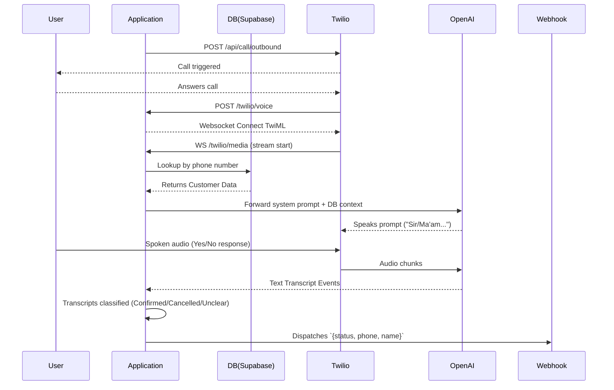

# Outbound AI Voice Agent

An automated outbound calling system powered by **Twilio**, **OpenAI Realtime API**, and **Supabase**.
Built using Python and FastAPI (suitable for deploying to Replit).

## Features
- **Outbound Calling:** Triggers calls via REST API using Twilio.
- **Realtime Integration:** Bridges Twilio Media stream to OpenAI's Realtime WebSocket.
- **Supabase Lookups:** Looks up customers via their phone number dynamically. 
- **Voice Response:** The agent speaks first upon connection: "Sir/Ma'am {name}, you ordered {product}. Do you want to confirm the order?".
- **Bilingual Understanding:** Handles 'Yes' / 'No' in both English and Bangla.
- **Deterministic Classification:** Transcripts verify user response, executing fallbacks if unclear.
- **Webhook Dispatch:** Fires the final call result (`confirmed`, `cancelled`, `unclear`, `not_found`) directly via webhook with retry mechanism.

## Architecture Diagram



## Setup & Execution

### 1. Variables Required (`.env`)
You should configure the following environment variables (using your Replit Secrets or local `.env` file):

- `OPENAI_API_KEY`: Key to OpenAI account possessing Realtime access.
- `OPENAI_REALTIME_MODEL`: E.g. `gpt-4o-realtime-preview`.
- `TWILIO_ACCOUNT_SID`: Account SID for Twilio.
- `TWILIO_AUTH_TOKEN`: Auth Token for Twilio.
- `TWILIO_FROM_NUMBER`: Registered outbound Twilio number.
- `PUBLIC_BASE_URL`: Public address of this deployment, for callbacks (e.g. `https://xxxx.replit.app` without a trailing slash).
- `SUPABASE_URL`: Setup URL for Supabase DB.
- `SUPABASE_SERVICE_ROLE_KEY`: Admin API key.
- `ORDER_STATUS_WEBHOOK_URL`: Target for webhook execution to digest order disposition callbacks.

### 2. Run instructions
To run via Python manually:
```bash
poetry install
poetry run uvicorn main:app --host 0.0.0.0 --port 8000
```
This is configured to start up automatically on Replit via the provided scripts.

### 3. Application usage steps
1. Deploy this Replit project using the defined `start` command.
2. In Twilio, make sure your Voice Webhook settings for numbers are no longer strictly referencing the inbound call flow, as this is primarily designed for outbound dialing. (Though the app supports TwiML fetch).
3. Connect your Supabase `orders` table (requiring `phone`, `customer_name`, `ordered_product`, `order_id` columns).
4. **Trigger calls:**
   Submit `POST` to `/api/call/outbound`:
   ```json
   {
      "to": "+8801XXXXXXXXX"
   }
   ```
5. Retrieve classification via **Webhook** listening on `ORDER_STATUS_WEBHOOK_URL`.
